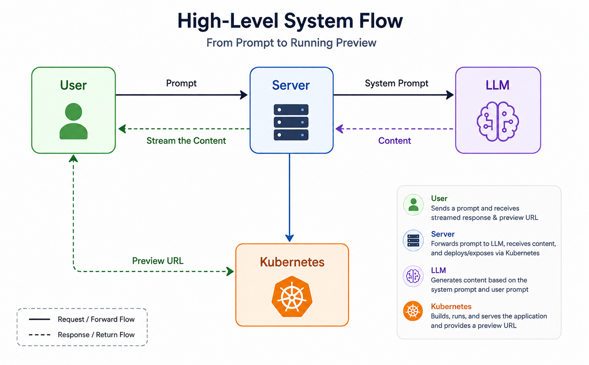
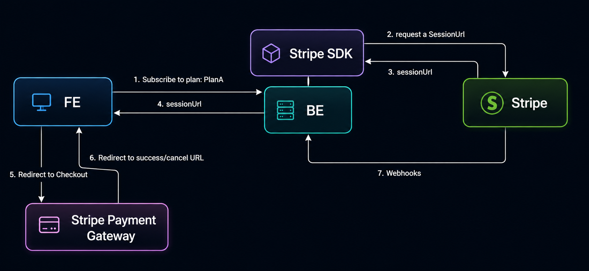

# PromptCanvas

<p align="center">
  <b>AI-powered application builder built with Spring Boot</b>
</p>

<p align="center">
  Describe an app in natural language, generate or modify its code through conversation, and eventually run it with a live preview.
</p>

<p align="center">
  
  
  
  
  
  
  
</p>

---

## Overview

PromptCanvas is an AI-powered application builder inspired by tools like Lovable and Bolt.

The idea is simple: describe what you want to build, let the AI generate the application, and then continue modifying that project through conversation.

```text
User Prompt
    ↓
Project Context + File Tree
    ↓
AI Generation + Tool Calling
    ↓
Generated / Modified Files
    ↓
MinIO Project Storage
    ↓
Execution Environment
    ↓
Live Preview
```

I am building the backend first so the AI layer has a proper system around it instead of being just a wrapper around an LLM call.

<p align="center">
  
</p>

---

## Features

### Currently implemented

- JWT-based authentication with Spring Security
- Project creation and management
- Project membership with `OWNER`, `EDITOR`, and `VIEWER` roles
- Permission-based authorization using `@PreAuthorize`
- PostgreSQL persistence with JPA / Hibernate
- MapStruct DTO mapping

#### Billing

- Stripe Checkout for subscriptions
- Stripe Customer Portal
- Subscription and billing-period tracking
- Stripe webhook verification and event handling
- Plan-based project creation checks

#### AI code generation

- Spring AI integration through an OpenAI-compatible API
- Streaming AI responses using Reactor `Flux` + Server-Sent Events
- Conversational code generation
- Project-aware file-tree context
- Custom Spring AI advisor for injecting the current project structure
- Tool calling for reading existing project files before modifying them
- Structured AI responses containing messages and generated files
- Parsing generated files from the streamed response
- Automatic persistence of generated/modified files

#### Project files and templates

- MinIO-based project file storage
- PostgreSQL metadata for project files
- File-tree and file-content APIs
- Preconfigured React starter template
- Automatic starter-template initialization when a new project is created
- Server-side copying of template files from the template bucket into a project-specific path

### Next

The next part of the backend is mainly about completing the conversation lifecycle around the generation system:

- Persisting AI chat events/messages and project chat history
- Connecting the existing chat-session models to the generation flow
- Tracking useful generation metadata and usage
- Finishing a few smaller project/file APIs and backend edge cases
- Improving the generation pipeline as more real project flows are tested

After that, the main focus will move to the **execution and preview system**.

The plan is to use Kubernetes to run generated applications in isolated environments and expose them through temporary preview URLs, so a user can see the generated application live while continuing to modify it through chat.

---

## AI Code Generation Flow

A generation request is not sent to the model blindly. PromptCanvas first gives the model context about the current project and lets it request existing files when needed.

```text
User asks for a change
        ↓
FileTreeContextAdvisor
        ↓
Current project file tree is added to AI context
        ↓
LLM decides which existing files it needs
        ↓
read_files tool call
        ↓
Files are fetched from MinIO
        ↓
Contents are returned to the LLM
        ↓
LLM generates complete file updates
        ↓
Response is streamed to the client through SSE
        ↓
<file> blocks are parsed
        ↓
Files are written back to MinIO
        ↓
ProjectFile metadata is updated in PostgreSQL
```

This keeps the model aware of the actual project instead of regenerating code without knowing what already exists.

---

## Starter Project

Every new PromptCanvas project starts from a preconfigured React template.

The current template uses:

- React 18
- TypeScript
- Vite
- Tailwind CSS 4
- daisyUI v5
- React Router
- TanStack Query
- React Hook Form + Zod
- Lucide React
- Sonner
- date-fns
- Recharts

The template is stored in MinIO and copied into a project-specific location whenever a new project is created.

```text
promptcanvas-starter-projects
└── react-vite-tailwind-daisyui-starter/
    ├── src/
    ├── public/
    ├── package.json
    └── ...

              ↓ new project #12

promptcanvas
└── 12/
    ├── src/
    ├── public/
    ├── package.json
    └── ...
```

For local setup instructions, see:

[Starter Template Setup](starter-templates/README.md)

---

## Stripe Subscription Flow

PromptCanvas uses Stripe for subscription billing.

The backend creates Checkout sessions, stores subscription state locally, and uses Stripe webhooks as the source of truth for renewals, failures, updates, and cancellations.

<p align="center">
  
</p>

---

## Tech Stack

**Backend**

- Java 21
- Spring Boot
- Spring Security
- Spring Data JPA
- Hibernate
- Spring AI
- Reactor
- Server-Sent Events
- MapStruct
- Maven

**Database & Storage**

- PostgreSQL
- MinIO

**AI**

- Spring AI
- OpenRouter through an OpenAI-compatible API
- Tool calling
- Project-aware context advisors

**Integrations**

- Stripe Checkout
- Stripe Customer Portal
- Stripe Webhooks

**Planned Runtime / Preview Infrastructure**

- Docker
- Kubernetes

---

## Configuration

Secrets should be loaded through environment variables rather than committed to Git.

Example:

```yaml
stripe:
  api:
    secret: ${STRIPE_SECRET_KEY}
  webhook:
    secret: ${STRIPE_WEBHOOK_SECRET_KEY}

spring:
  ai:
    openai:
      api-key: ${OPENAI_API_KEY}
      base-url: https://openrouter.ai/api/v1
      timeout: 300s
```

You will also need:

- PostgreSQL configuration
- JWT secret
- MinIO URL and credentials
- MinIO project bucket configuration

Example MinIO configuration:

```yaml
minio:
  url: http://localhost:9002
  access-key: ${MINIO_ACCESS_KEY}
  secret-key: ${MINIO_SECRET_KEY}
  project-bucket: promptcanvas
```

Do not commit real API keys or production credentials.

---

## Run Locally

Clone the repository:

```bash
git clone https://github.com/dev-aryank/promptcanvas.git
cd promptcanvas
```

Start the required local services, configure the environment variables, and make sure PostgreSQL and MinIO are available.

The React starter template also needs to exist in the configured MinIO template bucket before creating projects.

See:

[Starter Template Setup](starter-templates/README.md)

Then run the backend:

```bash
./mvnw spring-boot:run
```

On Windows:

```powershell
.\mvnw spring-boot:run
```

---

## Why PromptCanvas?

I wanted to understand what actually sits behind:

> "Describe an application and AI builds it."

The LLM call itself is only one part of the problem.

The rest involves project context, file handling, authentication, authorization, billing, tool calling, storage, conversation history, execution, isolation, and live previews.

PromptCanvas is my attempt at building that complete flow instead of stopping at the generation API.

---

## Project Status

> 🚧 **PromptCanvas is still actively being built.**

The backend foundation, authentication, authorization, project system, subscriptions, starter-template system, MinIO file storage, AI streaming, project-aware context, tool calling, and the first working code-generation pipeline are now in place.

Next I am completing the chat/event side of the AI workflow along with a few smaller backend pieces.

After that, the main focus will be the Kubernetes-based execution and live-preview system so generated projects can actually run and be viewed directly from PromptCanvas.
